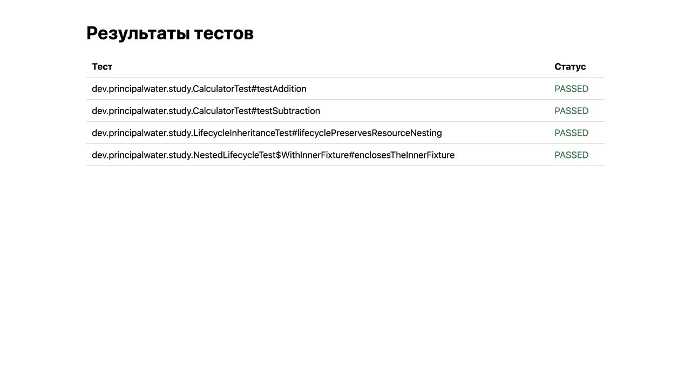

# Отчёт Surefire: Maven-плагин

Цель `report` собирает результаты тестов и сохраняет HTML-таблицу и TXT со строками `имя: PASSED|FAILED`. Java 21, Maven 3.9.16; дополнительные библиотеки для обработки файлов не нужны.

В задании указаны оба формата вывода, поэтому плагин создаёт оба файла с одним базовым именем. XML Surefire содержит все testcase; при его наличии TXT не читается, чтобы не дублировать сбои. Если XML нет, используется учебный TXT с отдельной строкой `имя Time elapsed: ...` для каждого метода. Краткий реальный TXT не позволяет восстановить имена успешных тестов. Для XML имя включает класс: `класс#метод`.

`failure` и `error` означают FAILED, остальные записи — PASSED согласно условию. Пропущенный тест здесь также PASSED: это упрощение задания, а не доказательство его выполнения. XML с DOCTYPE запрещён; имена экранируются в HTML, каждый выходной файл заменяется атомарно при поддержке файловой системы. Пара HTML/TXT не является единой транзакцией.

## Сборка и запуск

Откройте `pom.xml` как Maven-проект в IDE с JDK 21. Укажите установленный JDK 21 в `JAVA_HOME`. Из каталога плагина:

```sh
./mvnw -B --no-transfer-progress clean install
```

Проверка на JUnit-примере первого спринта из того же каталога:

```sh
./mvnw -B --no-transfer-progress -f ../../sprint01/junit5/pom.xml test \
  dev.principalwater.study:test-report-maven-plugin:1.0-SNAPSHOT:report
```

Параметры: `-DreportDirectory=target/surefire-reports`, `-DoutputFile=target/test-report.html`. При `.txt` создаётся также соседний `.html`; при `.html` — соседний `.txt`. Отсутствующие/пустые отчёты и ошибки чтения завершают сборку с объяснением. Для автоматического запуска после тестов настройте execution:

```xml
<plugin>
  <groupId>dev.principalwater.study</groupId>
  <artifactId>test-report-maven-plugin</artifactId>
  <version>1.0-SNAPSHOT</version>
  <executions><execution><phase>verify</phase><goals><goal>report</goal></goals></execution></executions>
</plugin>
```

`defaultPhase` сам не подключает плагин. Если Surefire прекращает сборку из-за ошибок тестов, сначала выполните тесты, затем вызовите цель отдельно. `-Dmaven.test.failure.ignore=true` допустим для демонстрации отчёта со сбоями; не используйте его как критерий успешной проверки.

Три проверки защищают полный XML→HTML/TXT отчёт, учебный текстовый формат и отказ от внешних XML entities. На JDK 21 все три прошли; установленный локально JAR сформировал HTML/TXT по четырём тестам отдельного проекта-потребителя. Несуществующий входной каталог дал ожидаемый BUILD FAILURE.



Источники: [Surefire](https://maven.apache.org/surefire-archives/surefire-3.2.5/maven-surefire-plugin/), [descriptor Maven-плагина](https://maven.apache.org/plugin-tools/maven-plugin-plugin/).

Scripts Maven Wrapper сохранены с исходными уведомлениями; [Apache License 2.0](.mvn/wrapper/LICENSE) относится к ним, а не ко всему решению.
