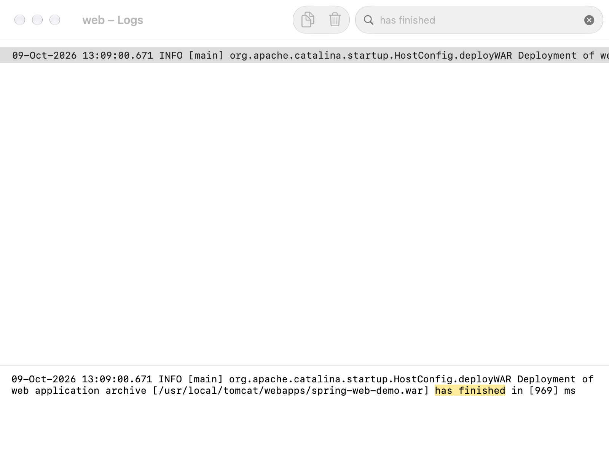

# Спринт 3 — Spring MVC, JDBC и файлы в Tomcat

## Цель

Развернуть WAR в контейнере сервлетов, реализовать HTTP-операции с пользователями в H2 и проверить загрузку/скачивание файлов.

## Описание

`DispatcherServlet` направляет запросы в контроллеры. Пользователи проходят цепочку Controller → Service → DAO → H2; JSON формируется Jackson. `/home` возвращает HTML. MultipartResolver принимает файлы, FilesService сохраняет их на диск и отдаёт бинарное содержимое.

| Запрос | Результат |
| --- | --- |
| `GET /home` | HTML, 200 |
| `GET /users` | JSON из H2, 200 |
| `POST /users` | Создание, 201 |
| `PUT /users/{id}` | Обновление, 204; отсутствующая запись — 404 |
| `DELETE /users/{id}` | Удаление, 204; отсутствующая запись — 404 |
| `POST /files/upload` | Имя сохранённого файла; свыше 5 МиБ — 413 |
| `GET /files/download/{filename}` | Исходные байты; неизвестный файл — 404 |

Пути приведены относительно `/spring-web-demo`. Некорректные данные пользователя и имена файлов получают 400. Исходное имя загрузки не участвует в пути: сервер выдаёт UUID. Незавершённая загрузка хранится временно и очищается; опубликованный файл не перезаписывается.

## Выполнение

1. Собрать приложение на JDK 21 из корня репозитория:

```bash
exercises/sprint01/junit5/mvnw -B --no-transfer-progress \
  -f exercises/sprint03/spring-mvc-jdbc/pom.xml clean package
```

2. В каталоге упражнения запустить отдельный Tomcat. Образ закреплён digest; порт `18081` не пересекается с проектом блога.

```bash
docker compose -p java-course-sprint03-exercise up -d
docker compose -p java-course-sprint03-exercise logs -f web
```

После сообщения об окончании развёртывания `spring-web-demo.war` можно открыть [страницу приложения](http://localhost:18081/spring-web-demo/home) и [список пользователей](http://localhost:18081/spring-web-demo/users).



Журнал подтверждает инициализацию DispatcherServlet и завершение развёртывания WAR. Предупреждения ниже возникли при проверке отказа файлам свыше 5 МиБ.

3. Выполнить HTTP-проверку на Python 3.11+ без дополнительных пакетов:

```bash
python3 verify.py
```

Проверяются HTML/JSON, UTF-8 и апостроф в SQL-параметре, создание/изменение/удаление, отказ невалидным данным, бинарная передача и ограничение размера. Созданный проверкой пользователь удаляется в finally; начальные данные не меняются. Загруженный тестовый файл остаётся в контейнере до его удаления.

Фактический запуск: Tomcat 10.1.60, JVM 21.0.12.1, Spring 6.2.19, H2 2.4.240, Jackson 2.20.1. Сборка завершилась `BUILD SUCCESS`, HTTP-проверка прошла, файл свыше 5 МиБ получил 413.

4. Завершить учебный запуск:

```bash
docker compose -p java-course-sprint03-exercise down
```

H2 работает в памяти, файлы — в слое контейнера. После его пересоздания изменения исчезают; исходные три пользователя добавляются заново. DriverManagerDataSource здесь не является пулом соединений.

## Уточнения реализации

Spring 6 использует `jakarta.servlet`; для Tomcat 10.1 выбраны Servlet API 6.0 с scope `provided` и web.xml 6.0. `javax.sql.DataSource` остаётся JDK API. Jackson подключается стандартной инфраструктурой `@EnableWebMvc`, отдельный неиспользуемый бин converter не создаётся. Для JdbcTemplate достаточно `spring-jdbc`, Spring Data repositories в упражнении нет. Схема инициализируется до DAO, а не повторным обработчиком refresh.

## Источники

- [Версии Tomcat и Servlet API](https://tomcat.apache.org/whichversion.html).
- [DispatcherServlet](https://docs.spring.io/spring-framework/reference/6.2/web/webmvc/mvc-servlet.html).
- [JdbcTemplate](https://docs.spring.io/spring-framework/reference/6.2/data-access/jdbc/core.html).
- [Multipart](https://docs.spring.io/spring-framework/reference/6.2/web/webmvc/mvc-servlet/multipart.html).
