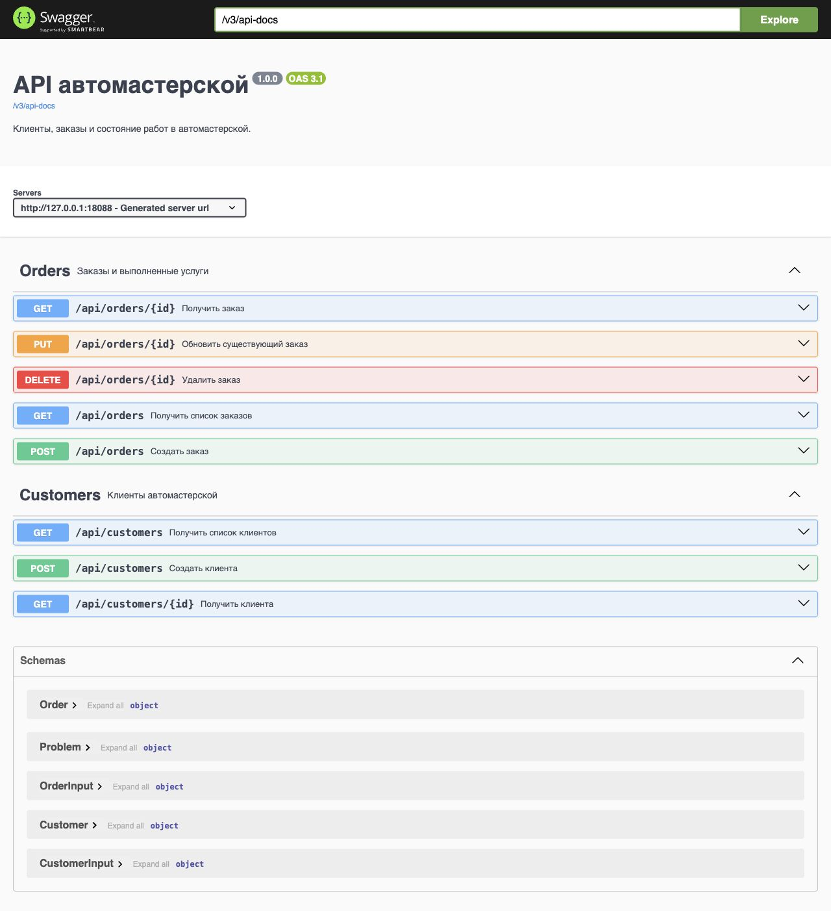

# Автомастерская: OpenAPI и работающий REST API

## Цель

Описать клиентов и заказы в OpenAPI, сгенерировать Java-контракты и собрать приложение, в котором все восемь операций доступны через HTTP и Swagger UI.

## Описание

Java 21, Maven Wrapper 3.9.16, Spring Boot 3.4.13, WebFlux, OpenAPI Generator 7.12.0 и SpringDoc 2.8.13. Maven Wrapper общий с упражнением первого спринта. Сервер слушает `127.0.0.1:18088`; записи хранятся в памяти и исчезают после остановки.

Клиент содержит id, имя, телефон и email. Заказ — id, модель автомобиля, услугу, статус, стоимость и customerId. У клиента несколько заказов; создать или переназначить заказ несуществующему клиенту нельзя. Статусы в JSON: Pending, In Progress, Completed.

## Этапы выполнения

### 1. Контракт и генерация

[workshop.yaml](src/main/resources/api/workshop.yaml) описывает пути, параметры, тела, ответы и переиспользуемые Components. Входные DTO отделены от выходных: идентификаторы назначает сервер. ID имеет формат int64, цена преобразуется в BigDecimal. Проверяются обязательные поля, положительные ID, неотрицательная цена, email и международный формат телефона; строки из пробелов отклоняются сервисом.

Для генератора 7.12.0 выбран проверенный контракт OAS 3.0.3. Динамическое описание SpringDoc публикуется в OAS 3.1. Версия API в обоих документах — 1.0.0. Эти версии описывают разные вещи: язык документа и само API.

Maven генерирует реактивные интерфейсы и DTO перед компиляцией. Реализация находится отдельно; файлы в target не редактируются и не коммитятся. Опции interfaceOnly и skipDefaultInterface исключают заглушки вместо бизнес-логики.

### 2. Клиенты и заказы

Контроллеры реализуют сгенерированные интерфейсы, сервис проверяет сценарии, репозиторий хранит неизменяемые записи в ConcurrentHashMap. Обновление заменяет заказ атомарно через computeIfPresent; удалённая запись не восстанавливается обновлением. В HTTP-цепочке нет block или subscribe. Контроллеры разделены по ресурсам, чтобы SpringDoc не дублировал операции в обеих группах.

| Метод и путь | Результат |
| --- | --- |
| GET /api/customers | Список клиентов, 200 |
| POST /api/customers | Новый клиент, 201 и Location |
| GET /api/customers/{id} | Клиент, 200; отсутствует — 404 |
| GET /api/orders | Список заказов, 200 |
| POST /api/orders | Новый заказ, 201 и Location; клиент отсутствует — 404 |
| GET /api/orders/{id} | Заказ, 200; отсутствует — 404 |
| PUT /api/orders/{id} | Полная замена существующего заказа, 200; заказ или клиент отсутствует — 404 |
| DELETE /api/orders/{id} | Удаление, 204 без тела; отсутствует — 404 |

Неверные параметры и тела дают 400. Ошибки возвращаются как application/problem+json; неудачное обновление сохраняет прежний заказ.

### 3. Сборка и Swagger UI

Из корня репозитория с JDK 21 в PATH:

```bash
./exercises/sprint01/junit5/mvnw -B --no-transfer-progress \
  -f exercises/sprint07/openapi-workshop/pom.xml clean package
java -jar exercises/sprint07/openapi-workshop/target/openapi-workshop.jar
```

Открыть [Swagger UI](http://127.0.0.1:18088/swagger-ui/index.html). JSON-описание доступно по [v3/api-docs](http://127.0.0.1:18088/v3/api-docs). Заголовок и версия задаются OpenAPI bean; Swagger UI использует описание работающего приложения.



### 4. Проверка

Прошли три интеграционных теста без ошибок и пропусков. Настоящий HTTP-сервер проверяет восемь операций, generated ID и Location, связь клиента с несколькими заказами, точность BigDecimal, смену статуса, удаление и сохранность соседнего заказа. Неверные тела, неизвестный статус, отрицательная цена, отсутствующий клиент и ID 0 отклоняются; прежние данные сохраняются. Отдельно проверяются опубликованные пути, формат ID, группы операций и выдача Swagger UI.

Проверка группировки воспроизвела ошибку на прежнем общем контроллере и прошла после разделения. JAR собран и запущен, Swagger UI проверен в браузере. Авторизация, постоянная БД и нагрузочная проверка в это упражнение не входят; in-memory-списки не гарантируют общий согласованный снимок при параллельных изменениях.

## Источники

- [OpenAPI 3.0.3](https://spec.openapis.org/oas/v3.0.3.html).
- [OpenAPI Generator 7.12.0: Maven Plugin](https://github.com/OpenAPITools/openapi-generator/blob/v7.12.0/modules/openapi-generator-maven-plugin/README.md).
- [SpringDoc: настройка OpenAPI и Swagger UI](https://springdoc.org/).
- [Spring Framework 6.2: WebTestClient](https://docs.spring.io/spring-framework/reference/6.2/testing/webtestclient.html).
