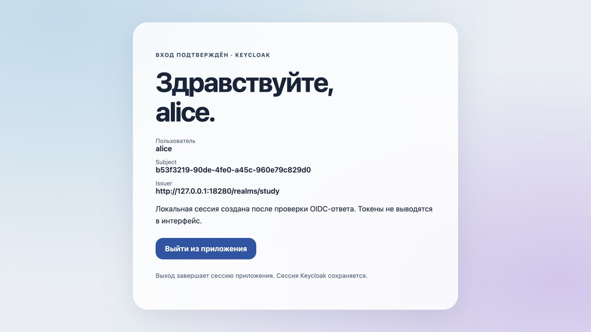

# Вход через Keycloak и локальная сессия Spring Security

## Цель

Проверить Authorization Code flow на работающем провайдере: приложение получает подтверждённую OIDC-личность, защищает профиль и завершает собственную сессию при выходе.

## Описание

Java 21, Spring Boot 3.4.13, Spring Security 6.4.13 и Keycloak 26.1.3. Spring MVC обслуживает две HTML-страницы и JSON-профиль; Keycloak работает в отдельном контейнере. Образ закреплён digest в [compose.yml](compose.yml).

| Адрес | Назначение |
| --- | --- |
| `http://127.0.0.1:18180/` | Публичная страница входа |
| `/profile` | Защищённый HTML-профиль |
| `/api/profile` | Только `subject`, `username`, `issuer`; без токенов |
| `/oauth2/authorization/keycloak` | Начало входа |
| `/login/oauth2/code/keycloak` | Callback зарегистрированного клиента |
| `POST /logout` | Локальный выход с CSRF-токеном |
| `http://127.0.0.1:18280/` | Keycloak |

## Выполнение

### 1. Подготовка провайдера

Из корня репозитория:

```bash
cd exercises/sprint08/oidc-login
python3 init.py
docker compose -p java-sprint08-oidc up -d --wait --wait-timeout 180
```

Скрипт создаёт случайные client secret, пароль учебного пользователя `alice` и bootstrap-пароль администратора в `target/lab.env`, с правами `600`. Повторный запуск сохраняет значения. Файл не входит в Git; значения не выводятся в консоль.

При старте импортируется [realm `study`](study-realm.json). В нём confidential client `study-login`, точный redirect URI и обязательный PKCE S256. Password grant и Implicit Flow отключены. Подстановка `${...}` при импорте берёт секреты из окружения контейнера. Учебная учётная запись использует вымышленные данные.

### 2. Сборка и запуск клиента

```bash
../../sprint01/junit5/mvnw -B --no-transfer-progress package
set -a
. target/lab.env
set +a
java -jar target/oidc-login.jar
```

Выбранный `JAVA_HOME` должен указывать на JDK 21. Spring получает metadata провайдера через `issuer-uri`; client registration описана в [application.yml](src/main/resources/application.yml). Resolver добавляет PKCE и сохраняет связь запроса с callback. Пароль пользователь вводит в форму Keycloak, не в приложение.

Для ручного входа используйте `alice` и её пароль из локального файла. После проверки OIDC-ответа приложение создаёт сессию и показывает профиль. Thymeleaf экранирует значения; форма выхода содержит CSRF-токен.



### 3. Проверка HTTP-flow

В другом терминале, при работающих контейнере и приложении:

```bash
python3 verify.py
```

Проверены анонимный доступ, Authorization Code + PKCE S256, отклонение неправильного пароля, успешный OIDC-вход и состав JSON без токенов. Для проверки `state` используется настоящий выданный код: после подмены параметра клиент остаётся неаутентифицированным.

POST без CSRF получает `403`. Штатный выход очищает сессию; повторный запрос со старым `JSESSIONID` требует нового входа. Все четыре группы проверок прошли. Скрипт использует стандартную библиотеку Python и допускает Secure-cookie на HTTP только для `127.0.0.1`, повторяя проверенное поведение браузера на loopback.

### 4. Остановка

Остановите Java-процесс и выполните:

```bash
docker compose -p java-sprint08-oidc down
```

Контейнер не имеет постоянного тома: его учебное состояние будет создано заново из realm-файла.

## Ограничения

Это локальный стенд: `start-dev`, HTTP и учебные версии не предназначены для публикации сервиса. Порты привязаны к loopback. Logout завершает сессию приложения, но оставляет сессию Keycloak; повторный вход через SSO может пройти без пароля. Отзыв access/refresh tokens, RP-initiated logout, TLS и нагрузка здесь не проверялись.

## Источники

[OAuth2 Login 6.4.13](https://github.com/spring-projects/spring-security/blob/6.4.13/docs/modules/ROOT/pages/servlet/oauth2/login/core.adoc), [OIDC Logout](https://github.com/spring-projects/spring-security/blob/6.4.13/docs/modules/ROOT/pages/servlet/oauth2/login/logout.adoc), [контейнер Keycloak](https://www.keycloak.org/server/containers), [импорт realm](https://www.keycloak.org/server/importExport).
