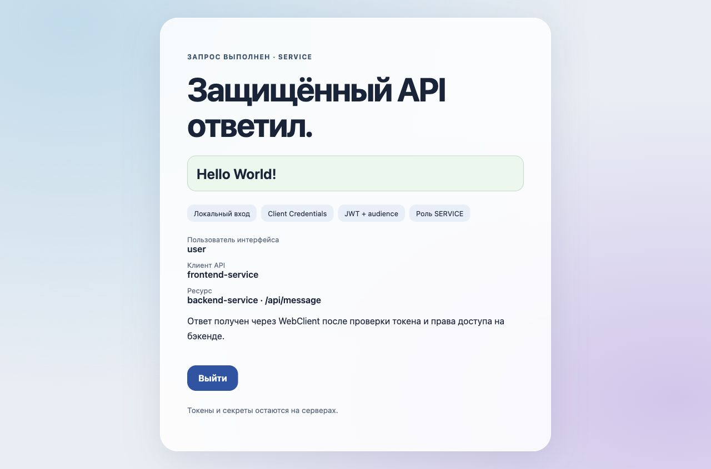

# Два WebFlux-сервиса с Client Credentials

## Цель

Собрать рабочую цепочку: пользователь входит во фронтенд, фронтенд получает сервисный JWT у Keycloak, бэкенд проверяет токен и роль `SERVICE`, после чего возвращает `Hello World!`.

## Описание

Два независимых приложения на Java 21, Gradle 8.14.3 и Spring Boot 3.5.7. BOM задаёт Framework 6.2.12 и Security 6.5.6. Keycloak 26.1.3 закреплён digest в [compose.yml](compose.yml).

| Компонент | Адрес | Ответственность |
| --- | --- | --- |
| `frontend-service` | `127.0.0.1:18181` | HTML, локальная форма входа, WebSession, WebClient |
| `backend-service` | `127.0.0.1:18182/api/message` | JWT resource server, проверка audience и `SERVICE` |
| Keycloak | `127.0.0.1:18281` | Realm `webflux-demo`, service accounts и выдача токенов |

Вход пользователя и межсервисная аутентификация разделены. Фронтенд хранит BCrypt-хеш пароля учебного пользователя `user` в памяти; к API обращается от имени `frontend-service`. Пароль пользователя и JWT не выводятся на страницу.

## Выполнение

### 1. Настройка Keycloak

Из корня репозитория:

```bash
cd exercises/sprint08/reactive-service-pair
python3 init.py
docker compose -p java-sprint08-service-pair up -d --wait --wait-timeout 180
```

[Realm-файл](webflux-demo-realm.json) импортируется при старте. Роль `SERVICE` назначена service account фронтенда. Audience mapper добавляет `backend-service` в JWT. Клиенты `viewer-test` и `wrong-audience-test` нужны для отрицательных проверок: у первого нет роли, у второго нет нужной audience.

Пять случайных секретов создаются в `target/lab.env` с правами `600`. Повторный запуск сохраняет значения; файл исключён из Git. Порты контейнера и приложений привязаны к loopback.

### 2. Сборка приложений

```bash
../../sprint02/file-transformer-gradle-plugin/gradlew --no-daemon bootJar
```

Выберите JDK 21 через `JAVA_HOME`. Получаются два самостоятельных JAR:

```text
backend-service/build/libs/backend-service.jar
frontend-service/build/libs/frontend-service.jar
```

Бэкенд сохраняет стандартную проверку issuer, подписи и времён действия, добавляет проверку audience. Чистый converter извлекает вложенный `realm_access.roles`; `@PreAuthorize` разрешает метод только с `SERVICE`. API не использует сессию и saved-request cache.

Фронтенд сохраняет CSRF для форм входа и выхода. Service manager использует постоянный application principal; WebClient прикрепляет токен только к фиксированному API бэкенда и возвращает реактивную цепочку без ручного `subscribe()`.

### 3. Запуск и проверка интерфейса

В двух терминалах, из папки упражнения:

```bash
java -jar backend-service/build/libs/backend-service.jar
```

```bash
set -a
. target/lab.env
set +a
unset COURSE_VIEWER_SECRET COURSE_WRONG_AUDIENCE_SECRET KC_BOOTSTRAP_ADMIN_PASSWORD
java -jar frontend-service/build/libs/frontend-service.jar
```

Откройте `http://127.0.0.1:18181/`, нажмите «Получить сообщение» и войдите как `user` с паролем из локального файла. Страница `/message` получает результат настоящего запроса к бэкенду.



### 4. Сквозные проверки

```bash
python3 verify.py
```

Четыре группы прошли: публичные страницы, запрет анонимного доступа, неверный пароль и CSRF; вход, смена ID сессии и настоящий M2M-вызов; JWT с допустимой ролью, без токена, без `SERVICE`, с другой audience и изменённой подписью; выход и запрет повторного доступа со старой сессией.

Проверка также фиксирует отсутствие `Set-Cookie` у бэкенда. При стандартном saved-request cache бэкенд получал чужой `SESSION` и отправлял его удаление: cookie не разделяются портами. Регрессия воспроизведена; `NoOpServerRequestCache` устраняет причину. Отдельная проверка страницы входа ловит ложное сообщение об ошибке при отсутствующем query-параметре.

В сравнении с исходным примером явно включена reactive method security, исправлены nested-claim mapping и подключение converter. Реальные HTTP-проверки заменяют подстановку `@WithMockUser` в клиент, подключённый к живому серверу.

### 5. Остановка

Остановите оба Java-процесса и выполните:

```bash
docker compose -p java-sprint08-service-pair down
```

## Ограничения

Стенд использует HTTP, `start-dev`, in-memory пользователя и учебные версии. После удаления контейнера его состояние создаётся заново. TLS, нагрузка, expiry по реальному ожиданию, отзыв уже выданных токенов и восстановление внешнего хранилища не проверялись. Helper имитирует Secure-cookie только для разрешённых loopback origins; credentials и токены остаются в памяти проверок.

## Источники

[Reactive OAuth2 Client 6.5.6](https://github.com/spring-projects/spring-security/blob/6.5.6/docs/modules/ROOT/pages/reactive/oauth2/client/core.adoc), [JWT Resource Server](https://github.com/spring-projects/spring-security/blob/6.5.6/docs/modules/ROOT/pages/reactive/oauth2/resource-server/jwt.adoc), [CSRF](https://github.com/spring-projects/spring-security/blob/6.5.6/docs/modules/ROOT/pages/reactive/exploits/csrf.adoc), [Keycloak import](https://www.keycloak.org/server/importExport).
