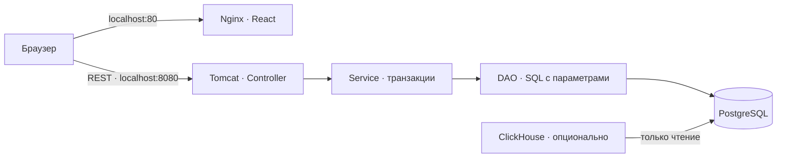

# Проектная работа: приложение-блог на Spring Framework · Спринт 3

[REST-контракт](docs/API.md)

## Цель

Разработать REST-бэкенд блога на Java 21 и Spring Framework, подключить реляционную БД и проверить работу приложения с предоставленным фронтендом.

## Описание

Реализованы посты с Markdown и изображениями, теги, комментарии, лайки, поиск и пагинация. Для хранения данных используется PostgreSQL; отдельный контур ClickHouse демонстрирует аналитику текущего состояния блога.

## Пошаговая инструкция выполнения

### Этап 1: Проектирование приложения

Spring Boot здесь не используется. Spring-контексты и сервлет объявлены явно в `web.xml`: корневой контекст содержит БД и сервисы, дочерний — MVC. Следующий спринт переводит приложение на Boot.



| Слой | Ответственность |
| --- | --- |
| Controller | HTTP, JSON, multipart, статусы ошибок |
| Service | Валидация, принадлежность комментария, транзакции |
| Model | Records, разбор поиска, превью Unicode |
| DAO | Параметризованный SQL, пакетная загрузка тегов |
| Database | Посты, упорядоченные теги, комментарии, каскадное удаление |

`schema.sql` создаёт структуру при запуске, сохраняет существующие данные. Обновление лайков выполняется атомарным SQL-инкрементом. Редактирование поста сохраняет лайки, комментарии и изображение.

#### Используемые технологии

Java 21 · Maven 3.9.16 · Spring Framework 6.2.19 · Spring Data JDBC 3.5.13 · Jackson 2.20.1 · HikariCP 6.3.3 · PostgreSQL 17 · Tomcat 10.1 · Nginx 1.29 · JUnit 5.14.4 · H2 2.4.240.

Spring Data JDBC подключён по требованиям задания; DAO использует явный Spring JDBC SQL для поиска, счётчиков и бинарных изображений. Docker-образы закреплены SHA256. Полный список зависимостей — в `pom.xml`.


*В `pom.xml` заданы Java 21, WAR, Spring и JUnit; исходники разделены по слоям. Снимок показывает конфигурацию проекта, а не запуск тестов в IDE.*

### Этап 2: Запуск инфраструктуры

Первая сборка требует интернет для зависимостей и [предоставленного фронтенда](https://code.s3.yandex.net/middle-java/my-blog-front-app.zip). Архив проверяется SHA256, готовая сборка React не хранится в Git.

Из корня репозитория:

```sh
cd projects/sprint03-spring-blog
docker compose up -d --build --wait
```

Открыть [блог](http://localhost/) и [API](http://localhost:8080/api/posts?search=&pageNumber=1&pageSize=5). Фронтенд обращается прямо к `localhost:8080`; стек предназначен для локального запуска. Сначала БД проходит healthcheck, затем бэкенд, затем фронтенд.

```sh
docker compose ps
docker compose logs backend
docker compose down
```

`down` сохраняет том БД. Пароль `blog-local` и пользователь `blog` — локальные значения; для изменения задайте `POSTGRES_DB`, `POSTGRES_USER`, `POSTGRES_PASSWORD` в `.env`. Порты опубликованы только на `127.0.0.1`; PostgreSQL доступен внутри Docker-сети. Аутентификация пользователей в этом спринте не реализована.


*В OrbStack запущены бэкенд, фронтенд, PostgreSQL и опциональный ClickHouse. Tomcat прошёл проверку готовности. Одноразовый `analytics-reader` завершился успешно после настройки роли чтения.*

### Этап 3: Работа с приложением

«Тетрадь инженера»: glass-панель управления, непрозрачные карточки и текст, системные шрифты, доступные имена кнопок, видимый фокус клавиатуры, адаптивные формы. Поддержаны тёмная тема, уменьшение анимации/прозрачности и повышенный контраст. Это web-адаптация принципов материалов Apple, без зависимости от native API.


*Тёмная тема сохраняет контраст текста и непрозрачный фон содержимого; эффект стекла остаётся в панели управления.*

Пост создаётся карандашом; заголовок и текст обязательны, теги разделяются пробелами. Сердце добавляет лайк при каждом нажатии. Поиск совмещает фразу заголовка и все `#теги` через AND; `pageSize` задаёт размер страницы. Изображения: PNG/JPEG/GIF/BMP, до 5 МиБ и 16 мегапикселей; тип определяется по содержимому.


*Лента заполнена демонстрационными постами об API, транзакциях и аналитике. Текст отображается как Markdown, превью ограничено 128 кодовыми точками Unicode.*


*Полный пост сохраняет текст и код. Комментарий с ID 6 успешно изменён через клиент у поста с ID 3 — исправленный маршрут не подменяет идентификатор поста.*


*Форма редактирования содержит изображение, название, Markdown и теги.*

### Этап 4: Сборка и тестирование

```sh
java -version                  # требуется JDK 21
./mvnw -B --no-transfer-progress verify
python3 scripts/smoke.py        # после запуска Compose
```

Для установленной через Homebrew Java 21 на macOS перед сборкой:

```sh
export JAVA_HOME="$(brew --prefix openjdk@21)/libexec/openjdk.jdk/Contents/Home"
export PATH="$JAVA_HOME/bin:$PATH"
```

В IntelliJ IDEA откройте `pom.xml` как Maven-проект и выберите JDK 21 в SDK проекта и настройках Maven Runner. Проверки ниже выполнены Maven на JDK 21, а не запуском JUnit из IDE.

27 сценариев JUnit проверяют модель, сервис, MVC и DAO. Интеграционные классы используют один кешируемый Spring TestContext и H2 в режиме совместимости с PostgreSQL. Откат сервиса проверяется настоящей ошибкой ограничения БД; конкурентные лайки — отдельными соединениями. `smoke.py` проверяет настоящий WAR/PostgreSQL и удаляет только созданный им пост. GitHub Actions повторяет сборку, проверки и контейнерную проверку; удалённый запуск CI станет доступен после публикации ветки.

Артефакт: `target/blog.war`. Для собственного Tomcat 10.1 скопируйте его в `webapps/ROOT.war`, задайте `DB_URL`, `DB_USER`, `DB_PASSWORD`, `CORS_ORIGINS` и запустите `bin/catalina.sh run`. Без `DB_URL` используется файловая H2 `./data/blog` относительно рабочего каталога контейнера. Для PostgreSQL пример URL: `jdbc:postgresql://localhost:5432/blog`. CORS принимает точные адреса источников, по умолчанию `http://localhost,http://127.0.0.1`.

### Этап 5: Аналитика PostgreSQL в ClickHouse

Опциональный контур читает текущее состояние PostgreSQL через ClickHouse `postgresql()` и ранжирует посты по лайкам/комментариям. Бэкенд → PostgreSQL → аналитический запрос: нет двойной записи, CDC или отдельной истории событий. Блог работает без ClickHouse.

```sh
docker compose -f compose.yaml -f compose.analytics.yaml --profile analytics up -d --wait
docker compose -f compose.yaml -f compose.analytics.yaml exec -T clickhouse \
  sh -c 'clickhouse-client --user analyst --password "$CLICKHOUSE_PASSWORD" --multiquery' \
  < analytics/engagement.sql
```

`ANALYTICS_DB_PASSWORD` и `CLICKHOUSE_PASSWORD` меняют локальные пароли `analytics-local` / `clickhouse-local`. PostgreSQL-роль `blog_reader` имеет только чтение нужных колонок; ClickHouse-профиль запрещает запись и ограничивает время, память и объём чтения. Это учебное чтение текущих данных: агрегации нагружают источник; при росте данных нужен отдельный контур загрузки/CDC. Прямое чтение источника — решение для малого локального набора, не рекомендация для производственного окружения.


*ClickHouse читает три демонстрационных поста и считает комментарии. Результат отражает изменения, выполненные через REST-бэкенд.*

## Полезные источники

- [Задание спринта 3](https://docs.google.com/document/d/1ru_KPMM0M2YgsXKFF0fVDcWV_DSJ1xVyYYQUhYMbri8/edit?tab=t.0)
- [Spring DispatcherServlet](https://docs.spring.io/spring-framework/reference/6.2/web/webmvc/mvc-servlet.html), [TestContext caching](https://docs.spring.io/spring-framework/reference/6.2/testing/testcontext-framework/ctx-management/caching.html)
- [HTTP GET, RFC 9110](https://www.rfc-editor.org/rfc/rfc9110.html#section-9.3.1)
- [ClickHouse PostgreSQL table function](https://clickhouse.com/docs/reference/functions/table-functions/postgresql)
- [Apple Materials](https://developer.apple.com/design/human-interface-guidelines/materials)
