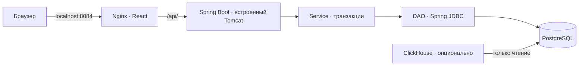
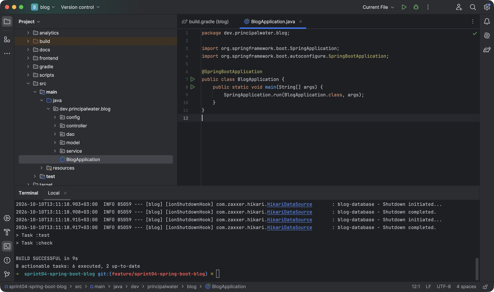
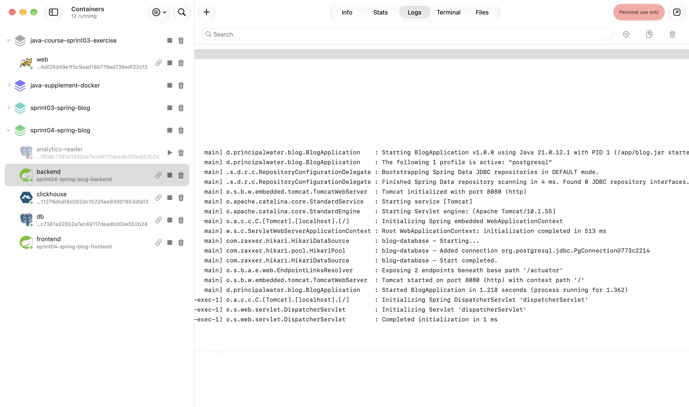
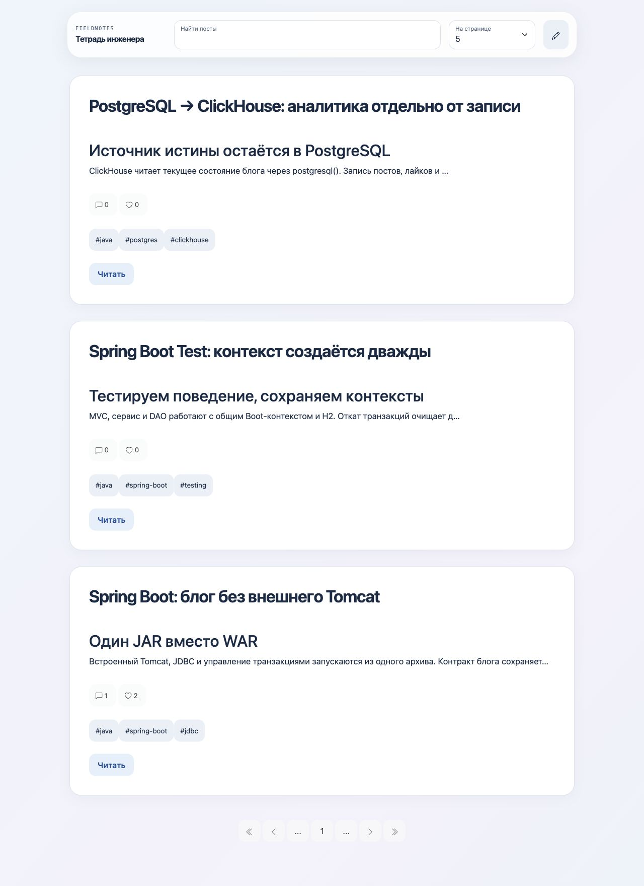
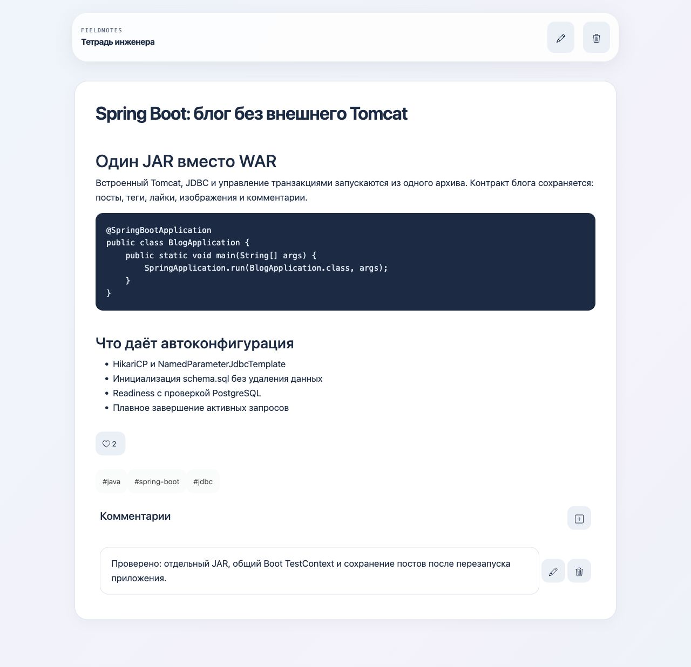
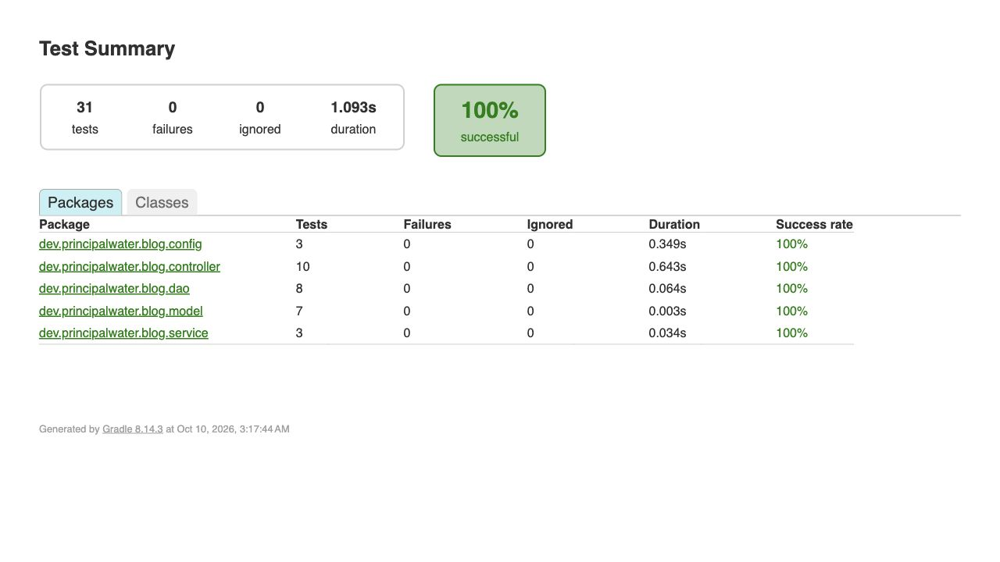

# Проектная работа: приложение-блог на Spring Boot · Спринт 4

[REST-контракт](docs/API.md) · [Предыдущий проект](../sprint03-spring-blog/)

## Цель

Перевести блог на Spring Boot и Gradle, упаковать исполняемый JAR и проверить приложение средствами Spring Boot Test.

## Описание

Блог сохраняет посты с Markdown и изображениями, теги, поиск, пагинацию, лайки и комментарии. Вместо WAR и внешнего Tomcat используется один JAR со встроенным сервером. PostgreSQL хранит данные; H2 позволяет запустить бэкенд без Docker. Аналитика ClickHouse остаётся отдельным, опциональным контуром.

## Пошаговая инструкция выполнения

### Этап 1: Перенос приложения на Boot

Новый модуль создан на основе каркаса Spring Initializr. В него перенесены модель, DAO, сервис, REST-контроллеры и фронтенд принятого проекта спринта 3; предыдущий каталог и история Git сохранены.

| Было в спринте 3 | Стало в спринте 4 |
| --- | --- |
| Maven, WAR, внешний Tomcat | Gradle Wrapper 8.14.3, `bootJar`, встроенный Tomcat |
| `web.xml`, два Spring-контекста | `BlogApplication` с `@SpringBootApplication` |
| Ручные JDBC/MVC-бины | Автоконфигурация пула, JDBC, транзакций, MVC и multipart |
| `blog.properties`, чтение файлов паролей | `application.properties`, профиль PostgreSQL и `configtree:` |
| Spring TestContext с ручной сборкой MockMvc | `@SpringBootTest`, `@AutoConfigureMockMvc`, общий профиль H2 |

Изменения по файлам: [build.gradle](build.gradle) заменяет `pom.xml`, [BlogApplication](src/main/java/dev/principalwater/blog/BlogApplication.java) — `web.xml`. [WebConfig](src/main/java/dev/principalwater/blog/config/WebConfig.java) и [CorsProperties](src/main/java/dev/principalwater/blog/config/CorsProperties.java) дополняют MVC Boot; [PostgresqlConfig](src/main/java/dev/principalwater/blog/config/PostgresqlConfig.java) и [application properties](src/main/resources/application.properties) заменяют ручную JDBC-конфигурацию. [Профиль PostgreSQL](src/main/resources/application-postgresql.properties) подключает config tree. [BlogIntegrationTest](src/test/java/dev/principalwater/blog/BlogIntegrationTest.java) задаёт общий тестовый контекст; [EmbeddedServerTest](src/test/java/dev/principalwater/blog/controller/EmbeddedServerTest.java) проверяет настоящий servlet-контейнер. [Dockerfile](Dockerfile) упаковывает JAR в образ JRE, [адаптер фронтенда](frontend/prepare.py) сохраняет клиент и исправляет обнаруженные ошибки. Модель, SQL и бизнес-операции перенесены из спринта 3.

Системные ошибки унифицированы на английском: [ApiErrorHandler](src/main/java/dev/principalwater/blog/controller/ApiErrorHandler.java), [RequestError](src/main/java/dev/principalwater/blog/service/RequestError.java) и [BlogEntity](src/main/java/dev/principalwater/blog/model/BlogEntity.java). HTTP-статусы и JSON-поле `error` сохранены; комментарии в коде и интерфейс остаются русскими.

**Используемые технологии:** Java 21 · Spring Boot 3.5.16 · Spring Framework 6.2.19 · Spring Data JDBC 3.5.13 · Gradle 8.14.3 · JUnit Jupiter 5.12.2 · PostgreSQL 17 · встроенный Tomcat 10.1.

Версии библиотек согласованы через native Gradle platform и BOM Boot. Отдельные версии Jackson, HikariCP и JUnit не задаются. Boot 3.5 сохраняет Framework 6 и JUnit 5; переход на Boot 4 и смена поколения тестовой платформы здесь не нужны. Initializr уже предлагает Boot 4, поэтому после генерации каркас адаптирован к Boot 3.5 и совместимому Gradle 8.



Nginx обслуживает только готовую React-сборку и проксирует `/api/` в Java-процесс. Бэкенд запускается командой `java -jar blog.jar` во встроенном Tomcat; Nginx не является servlet-контейнером и не запускает Java-код. Самостоятельный JAR работает без Nginx и Docker, как показано ниже.

`WebConfig` расширяет MVC через `WebMvcConfigurer`, без `@EnableWebMvc`: иначе ручная конфигурация вытеснила бы настройки Boot. CORS связывается с типизированными `CorsProperties`; пустые origins, wildcard и отрицательный срок кеширования отклоняются при старте.

DAO использует `NamedParameterJdbcTemplate` из Data JDBC starter: параметризованный SQL удобен для сочетания тегов и заголовка, счётчиков и бинарных изображений. Дополнительные repository-интерфейсы не нужны. Boot создаёт JDBC-инфраструктуру, а в сервисе сохраняются границы `@Transactional`.

### Этап 2: Сборка и самостоятельный запуск JAR

Нужен JDK 21. Gradle скачивается wrapper-скриптом, архив проверяется SHA256. Для Homebrew на macOS:

```sh
export JAVA_HOME="$(brew --prefix openjdk@21)/libexec/openjdk.jdk/Contents/Home"
export PATH="$JAVA_HOME/bin:$PATH"
```

Из корня репозитория:

```sh
cd projects/sprint04-spring-boot-blog
./gradlew --no-daemon --console=plain clean check bootJar
python3 scripts/verify-jar.py
java -jar build/libs/blog.jar --server.port=18085
```

Артефакт — `build/libs/blog.jar`; обычный неисполняемый JAR отключён, чтобы не перепутать архивы. Без профиля используется файловая H2 `./data/blog` относительно рабочего каталога. В новой вкладке терминала:

```sh
python3 scripts/smoke.py --base-url http://localhost:18085
```

`verify-jar.py` сам запускает готовый архив на свободном порту с отдельной H2, проверяет HTTP и завершает только свой процесс. Его временные данные удаляются. `smoke.py` удаляет только собственный проверочный пост; пользовательские записи остаются.

Проект открыт в отдельном окне IntelliJ IDEA. Для импорта открыть `build.gradle` как проект. Выбрать JDK 21 в Project SDK и Gradle JVM; сборку и тесты запускать через Gradle Wrapper. Если Homebrew JDK не обнаружен автоматически, добавить его каталог через Add JDK. Настройки конкретного компьютера в Git не хранятся.



*`BlogApplication` запускает приложение; `check bootJar` выполнен через терминал проекта с JDK 21.*

> **Примечание об упаковке:** `bootJar` содержит зависимости и загрузчик Boot; внешний servlet-контейнер не нужен. `buildInfo()` добавляет метаданные архива в `/actuator/info`. Docker-сборка извлекает слои стандартным `jarmode=tools`: зависимости кешируются отдельно от классов приложения, а runtime использует JRE 21 без Maven/Gradle.

### Этап 3: PostgreSQL, Docker secrets и готовность приложения

Для Compose нужны Docker/OrbStack и Python 3.9+. Первая сборка требует сеть для Gradle, Maven Central, образов и [готового фронтенда](https://code.s3.yandex.net/middle-java/my-blog-front-app.zip). Архив React проверяется SHA256; готовая сборка не хранится в Git.

```sh
python3 scripts/init-secrets.py
export BLOG_UID="$(id -u)" BLOG_GID="$(id -g)"
docker compose up -d --build --wait
python3 scripts/smoke.py --frontend-url http://localhost:8084
```

Открыть [блог](http://localhost:8084/), [REST API](http://localhost:18084/api/posts?search=&pageNumber=1&pageSize=5), [готовность](http://localhost:18084/actuator/health/readiness) и [метаданные JAR](http://localhost:18084/actuator/info). Порты доступны только на `127.0.0.1`; PostgreSQL не публикуется на хост. Спроектирован отдельный стек спринта 4: том, сеть и secrets не затрагивают спринт 3. Пустая БД не заполняется автоматически; посты создаются через интерфейс или API.

```sh
docker compose ps
docker compose logs backend
docker compose down
```



*В журнале бэкенда видны `/app/blog.jar`, профиль PostgreSQL и встроенный Tomcat 10.1.55. Завершённый `analytics-reader` — одноразовая настройка роли чтения.*

`down` сохраняет том PostgreSQL. `schema.sql` через Boot SQL initialization создаёт отсутствующие таблицы/индексы, не удаляет записи. Для изменения структуры существующей БД позднее нужны версионируемые миграции.

Пароли генерируются вне репозитория в `~/.config/java-engineering-course/sprint04/`: каталог `0700`, файлы `0600`. Инициализатор сохраняет существующие значения, отклоняет пустые файлы и симлинки. PostgreSQL получает `db_password`; для бэкенда тот же файл монтируется как `/run/secrets/spring.datasource.password`. Профиль `postgresql` импортирует каталог через `configtree:`; собственный парсер секретов не требуется. Отсутствующий каталог или пустой пароль останавливают запуск.

На Linux file secrets являются bind-mount: Compose не меняет их UID/GID и mode. Поэтому бэкенд запускается с `BLOG_UID/BLOG_GID` владельца файлов. Образ по умолчанию использует непривилегированный UID 10001; при запуске Compose используются заданные UID/GID. Файлы остаются `0600`, пароль не передаётся через environment. При повторном старте с существующим томом файл должен соответствовать действующему паролю роли PostgreSQL; генератор пароль роли не меняет.

> **Примечание о secrets:** Compose разграничивает доступ к plaintext-файлам, а не шифрует их. Для рабочего окружения нужен внешний Vault/secret manager с ротацией; TLS соединения и шифрование хранения настраиваются отдельно. Пароли не должны попадать в JDBC URL, Git и логи.

Readiness включает состояние Boot и проверку БД. Liveness проверяет жизнеспособность процесса, без PostgreSQL: потеря общего хранилища не должна запускать бесконечные рестарты. Наружу открыты только `health` и `info`, без деталей БД, environment и configprops. Graceful shutdown ждёт активные запросы до 20 секунд; Compose даёт процессу 30 секунд до принудительного завершения.

| Настройка | Назначение |
| --- | --- |
| `SPRING_PROFILES_ACTIVE=postgresql` | Внешняя БД и обязательный config tree; Compose задаёт профиль |
| `DB_URL`, `DB_USER` | JDBC URL и пользователь профиля PostgreSQL; Compose собирает URL из имени БД |
| `BLOG_SECRETS_DIR` | Каталог файлов secrets на хосте |
| `BLOG_SECRETS_LOCATION` | Каталог config tree при запуске JAR; по умолчанию `/run/secrets/`, нужен конечный `/` |
| `BLOG_UID`, `BLOG_GID` | Владелец file secrets для процесса в Compose |
| `POSTGRES_DB`, `POSTGRES_USER` | Имя БД и роли при первичной инициализации; defaults `blog` |
| `BACKEND_PORT`, `FRONTEND_PORT`, `ANALYTICS_PORT` | Внешние порты: `18084`, `8084`, `8124` |
| `BLOG_CORS_ORIGINS`, `BLOG_CORS_MAX_AGE` | Точные origins через запятую и Duration; defaults `http://localhost,http://127.0.0.1` и `1h` |

Стандартные `SPRING_DATASOURCE_*`, `SPRING_DATASOURCE_HIKARI_*` и `SERVER_PORT` доступны при самостоятельном запуске. Для внешнего PostgreSQL профиль должен быть включён, а файл пароля — доступен процессу. Разбор пароля проверен настоящим JDBC-соединением: конечный LF убирается, значимые пробелы сохраняются.

### Этап 4: Работа с блогом

Сохранена «Тетрадь инженера»: стеклянная панель управления, непрозрачные карточки, системные шрифты, клавиатурный фокус и адаптивные формы. Оформление поддерживает тёмную тему, уменьшение движения/прозрачности и повышенный контраст.



*Демонстрационные посты посвящены Boot, тестовым контекстам и аналитике. Их данные находятся в PostgreSQL; создание поста без картинки проверено через интерфейс.*

Карандаш открывает форму поста; заголовок и текст обязательны, теги разделяются пробелами. Сердце добавляет лайк. Поиск совмещает фразу заголовка и все `#теги` через AND; превью сохраняет первые 128 кодовых точек Unicode. PNG/JPEG/GIF/BMP проверяются по содержимому: до 5 МиБ и 16 мегапикселей.



*Пост с ID 2: код Java, два лайка и комментарий, изменённый через клиент. После полной перезагрузки текст и комментарий сохранены.*

Фронтенд отправляет same-origin `/api/` через Nginx, без привязки к `localhost:8080`. Прокси сохраняет полный `Host` с портом: при `$host` порт терялся, и Spring ошибочно применял CORS к запросу с того же origin. Регрессия проверена через HTTP с одинаковыми Host/Origin вне CORS allowlist: до исправления 403, после — 200. Исправления маршрута и ранней загрузки комментариев сохранены. JSON-загрузчики постов и комментариев проверяют HTTP-статус: ответ 400 больше не закрывает форму и не переводит на `/posts/undefined`. Дополнительно исправлено сохранение без картинки: placeholder `{}` не является Blob; отсутствие изображения больше не превращает JSON 404 в картинку.

> **Примечание о multipart:** реальный Tomcat сбрасывал соединение при файле чуть больше 5 МиБ: стандартный `maxSwallowSize` — 2 МиБ. Значение связано с ограниченным `max-request-size=6MB`; сервер дочитывает отклонённую загрузку и возвращает JSON 413. Дочитывание не сделано бесконечным; существенно большие прямые запросы могут завершаться сбросом. Это проверено отдельным HTTP-тестом, поскольку MockMvc не проходит servlet-парсер загрузок.

REST-пути и JSON сохранены. Чтение поста остаётся GET: POST в исходном документе противоречил готовому клиенту и семантике HTTP. POST на адрес чтения возвращает 405.

### Этап 5: Spring Boot Test и кеширование контекстов

```sh
./gradlew --no-daemon --console=plain test
python3 -m unittest discover -s src/test/python
python3 scripts/verify-jar.py
python3 scripts/smoke.py --frontend-url http://localhost:8084
```

Последняя команда требует запущенный Compose. Отчёты JUnit находятся в `build/test-results/test/`, HTML — `build/reports/tests/test/index.html`.

| Граница проверки | Что защищает |
| --- | --- |
| Model, без Spring | Разбор поиска, Unicode и граница превью |
| DAO + H2 | SQL-поиск, буквальные метасимволы, порядок, теги, каскады и конкурентные лайки |
| Service + H2 | Сохранение изображения/счётчиков при правке, пагинация, реальный откат составной записи |
| MockMvc | JSON и методы REST, принадлежность комментария, multipart, валидация и CORS |
| Boot `RANDOM_PORT` | HTTP 413 настоящего Tomcat и сохранение данных после отклонённой загрузки |
| `ApplicationContextRunner` | Config tree, реальные credentials JDBC и отказ небезопасной конфигурации |



*31 сценарий JUnit Jupiter: модель, MVC, DAO, сервис, конфигурация и встроенный сервер. Дополнительно проходят две CLI-проверки генератора secrets.*

Три интеграционных класса наследуют единый `BlogIntegrationTest` с `@SpringBootTest`, `@AutoConfigureMockMvc`, профилем `test` и H2. Данные откатываются через `@Transactional`, контекст не пересоздаётся. Диагностика кеша подтвердила **два полных контекста**: общий MVC/Service/DAO и отдельный `RANDOM_PORT`; `missCount=2`, без `@DirtiesContext`. Небольшие `ApplicationContextRunner` изолированно проверяют конфигурационные отказы.

> **Примечание о транзакциях тестов:** HTTP-сервер работает в другом потоке и не участвует в транзакции теста. `EmbeddedServerTest` явно удаляет свой пост. Проверка отката сервиса, напротив, отключает внешнюю транзакцию теста и провоцирует ошибку второго INSERT: иначе откат тестового метода скрывал бы проблему самого сервиса.

### Этап 6: Опциональная аналитика ClickHouse

```sh
docker compose -f compose.yaml -f compose.analytics.yaml --profile analytics up -d --wait
docker compose -f compose.yaml -f compose.analytics.yaml exec -T clickhouse \
  sh -c 'clickhouse-client --user analyst --password "$(cat "$CLICKHOUSE_PASSWORD_FILE")" --multiquery' \
  < analytics/engagement.sql
```

`postgresql()` читает актуальные посты и комментарии через отдельную роль `blog_reader`. ClickHouse ранжирует их по лайкам и комментариям, без копирования картинок и двойной записи. Роль PostgreSQL имеет только SELECT нужных столбцов; профиль ClickHouse запрещает запись и ограничивает время, строки, объём и память. `analytics-reader` настраивает роль один раз перед стартом ClickHouse.

Проверенный результат: пост про Boot — 2 лайка и 1 комментарий, два остальных — 0/0. Блог прошёл smoke-проверку при остановленном ClickHouse. Запрос читает небольшой локальный набор текущих данных; при росте нагрузки нужен отдельный контур загрузки/CDC. Не используйте такое прямое чтение как универсальную архитектуру для больших данных.

## Полезные источники

- [Задание спринта 4](https://practicum.yandex.ru/learn/middle-java-pro/courses/e9c0659a-c7cd-4422-bd42-f49e04ab0957/sprints/922058/topics/9606ed0d-d5c5-4cee-a035-a8554bca8e3b/lessons/47e4e383-0928-424e-b4ac-5976bb7f4430/)
- [Spring Boot 3.5: требования](https://docs.spring.io/spring-boot/3.5/system-requirements.html), [упаковка Gradle](https://docs.spring.io/spring-boot/3.5/gradle-plugin/packaging.html), [Boot Test](https://docs.spring.io/spring-boot/3.5/reference/testing/spring-boot-applications.html)
- [Tomcat maxSwallowSize](https://tomcat.apache.org/tomcat-10.1-doc/config/http.html), [Docker Compose file secrets](https://docs.docker.com/reference/compose-file/services/#secrets)
- [HTTP GET, RFC 9110](https://www.rfc-editor.org/rfc/rfc9110.html#section-9.3.1), [ClickHouse PostgreSQL](https://clickhouse.com/docs/reference/functions/table-functions/postgresql)
